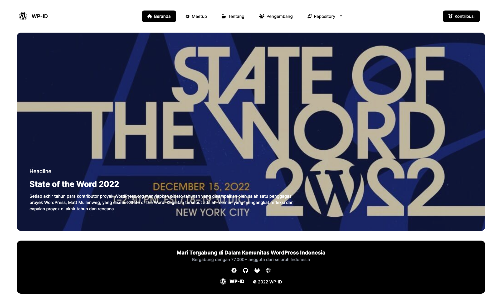

# Komunitas WordPress Indonesia

Headless WordPress website dari [WP-ID](https://wp-id.org). 

[🌐 Lihat Website Sekarang](https://agung2001.github.io/wp-id.github.io)

## 📝 Installation
1. Rename : `.env-sample` to `.env`
2. Install npm package : `npm i`
3. Build assets : `grunt build`
4. Run server : `npm run dev`

## 🚀 Deployment
- Development : `npm run build:development`
- Production : `npm run build:production`

## ⚒️ Tools
- [GruntJS](https://gruntjs.com/)
- [JamesIves/github-pages-deploy-action](https://github.com/JamesIves/github-pages-deploy-action)
- [MomentJS](https://momentjs.com/)
- [SvelteKit](https://kit.svelte.dev/)
- [TailwindCSS](https://tailwindcss.com/)
