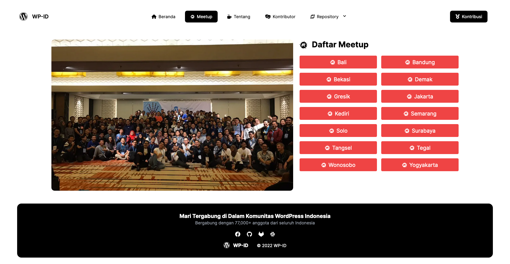

# Komunitas WordPress Indonesia

Headless WordPress website dari [WP-ID](https://wp-id.org).

[🌐 Lihat Website Sekarang](https://agung2001.github.io/wp-id.github.io)

### 📝 Disclaimer 
- Repository ini bukanlah website resmi komunitas WordPress Indonesia.
- Website ini hanya di peruntukan sebagai direktori kontributor, plugin dan tema.
- Website ini akan di archive setelah fitur diatas selesai.

## 🎉 Berkontribusi
Ingin terlibat sebagai kontributor atau sponsor?
Lihat panduan berkontribusi [disini](CONTRIBUTING.md)

## 🚀 Installasi

### 👨‍💻 Manual
1. Ganti nama : `.env-sample` to `.env`
2. Install paket npm : `npm i`
3. Bangun asset : `grunt build`
4. Jalankan server : `npm run dev`

### 🐳 via docker
- GHCR : `docker run -d -p 80:80 ghcr.io/agung2001/wp-id.github.io:master`
- Docker Hub : `docker run -d -p 80:80 agung2001/wp-id.github.io:master`

## ⚒️ Perpusatakaan
- [GruntJS](https://gruntjs.com/)
- [JamesIves/github-pages-deploy-action](https://github.com/JamesIves/github-pages-deploy-action)
- [MomentJS](https://momentjs.com/)
- [SvelteKit](https://kit.svelte.dev/)
- [TailwindCSS](https://tailwindcss.com/)
